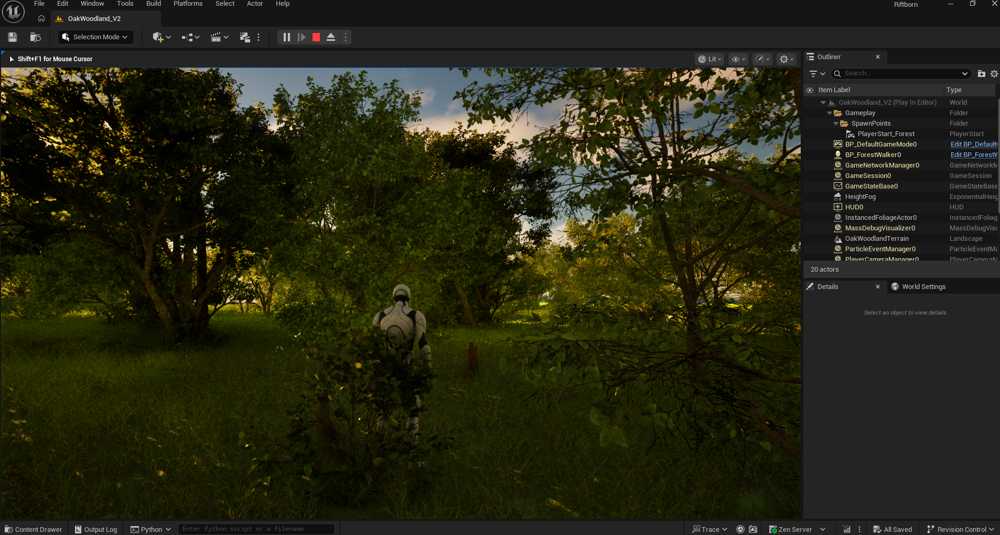
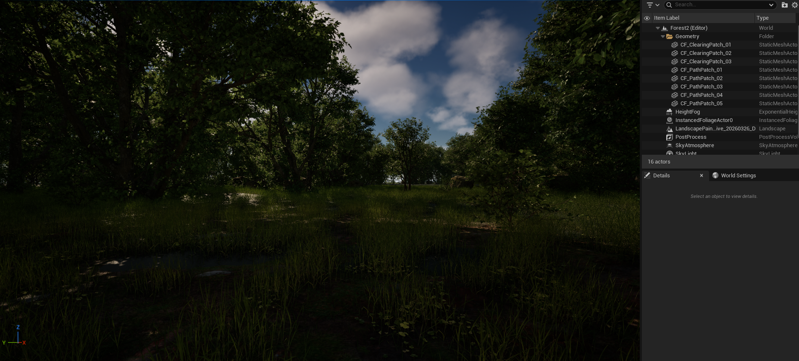

# RiftbornAI

Governed Unreal Editor automation for UE 5.7.

- Status: beta
- Surfaces: native Unreal Editor panel and MCP server
- License: BSL 1.1 with Apache 2.0 as the change license

RiftbornAI is a UE 5.7 editor plugin for controlled scene and content
automation. It can drive supported workflows such as landscapes, lighting,
materials, Blueprints, characters, foliage, and cinematics from
natural-language instructions, either through the built-in editor panel or
through an MCP client.

Public beta packages ship the governed production MCP surface and a smaller
beta workflow set used for release validation. Source builds and dev mode keep
the broader development surface available.

Supported MCP clients include **Claude Desktop**, **Claude Code**, **Cursor**,
**VS Code**, **Windsurf**, and other stdio clients that speak
[Model Context Protocol](https://modelcontextprotocol.io). The plugin also
ships with a native **C++/Slate panel inside Unreal Editor** for chat, plans,
approvals, tool browsing, and execution history.

Current repository releases are source-available under Business Source License
1.1 with Apache 2.0 as the change license. Using RiftbornAI to build your own
games or client deliverables is allowed. Selling a competing RiftbornAI-based
plugin, hosted service, OEM package, or white-label offering requires a
separate commercial license.





Example scenes built with the shipped editor workflows: terrain, foliage,
lighting, water, post-process, and a playable character.

## What It Does

- **In-editor panel**: Native C++/Slate Unreal Editor panel for chat, plans,
  approvals, tool browsing, and execution review.
- **Environment workflows**: Landscapes, terrain sculpting, layered
  materials, weight-painted foliage, procedural grass, fog, water, and
  post-process volumes.
- **Lighting and visual checks**: Directional, point, spot, and rect lights;
  sky atmosphere; exponential height fog; optional viewport capture and
  follow-up checks for supported workflows.
- **Blueprint and gameplay setup**: Blueprint creation, component wiring,
  variable and event setup, compilation, character spawning, navigation, AI
  perception, behavior trees, and basic GAS support.
- **Materials**: PBR material graphs from textures or parameters, material
  instances, and landscape blends.
- **Animation and rigging**: IK rigs, retargeters, control rigs, blend
  spaces, animation montages, and pose-search setup.
- **Procedural tools**: PCG graphs, Niagara systems, procedural foliage, and
  dynamic mesh utilities.
- **Cinematics**: Level sequences, camera animation, bindings, keyframes,
  and playback control.
- **C++ scaffolding**: Gameplay-facing class generation and source edits with
  build-oriented validation.

## Quick Start

Get the latest release zip from
[GitHub Releases](https://github.com/RiftbornGit/RiftbornAI/releases).

### 1. Copy the plugin

```text
YourProject/
  Plugins/
    RiftbornAI/    <-- extract the release zip here
  YourProject.uproject
```

### 2. Run the one-command installer

The release ships with the MCP server prebuilt. The installer:

1. **Enables RiftbornAI in your `.uproject`**: required because several of
   RiftbornAI's UE plugin dependencies (ChaosMover, LearningAgents,
   ContextualAnimation, MassCrowd, etc.) are experimental and not enabled
   by default. UE only cascade-enables them when their parent plugin is
   itself listed in the project.
2. Verifies the shipped `mcp-server/` runtime. In packaged beta releases this
  should pass immediately because the release now ships a runtime-ready tree
  (`dist/` plus production `node_modules/`). For source checkouts, the
  installer falls back to `npm install --omit=dev --ignore-scripts --no-audit --no-fund`.
3. Registers the MCP server with every supported MCP client
   (Claude Desktop, VS Code, Cursor, Windsurf).

On Windows, the plugin also checks GitHub Releases after startup settles,
downloads packaged updates in the background, and queues them to apply the
next time the editor closes by replacing the plugin folder, rerunning setup,
and relaunching the project.

**Windows (PowerShell):**

```powershell
Setup\install.ps1
```

If blocked by execution policy:
`PowerShell -ExecutionPolicy Bypass -File Setup\install.ps1`

**macOS / Linux:**

```bash
bash Setup/install.sh
```

See [`Setup/README.md`](Setup/README.md) for what the installer does and how
to uninstall.

### 3. Open your project in UE 5.7

The plugin loads automatically. Check the Output Log for:

```text
RiftbornAI bridge started on port 8767
```

### 4. Open the in-editor copilot panel

Inside Unreal Editor, open **Window -> RiftbornAI** or click the RiftbornAI
button in the Level Editor toolbar. This opens the native dockable Slate
copilot panel that lives inside UE.

### 5. Connect external MCP clients

This is already done by the installer.

The installer wrote a `riftborn` server entry into your global config for
Claude Desktop / VS Code / Cursor / Windsurf. Restart the client to pick
it up. If you need to configure it manually:

```json
{
  "mcpServers": {
    "riftborn": {
      "command": "node",
      "args": ["<absolute-path>/Plugins/RiftbornAI/mcp-server/dist/index.js"]
    }
  }
}
```

### 6. Start building

```text
"Create a landscape with rolling hills, paint it with grass and rock layers"
"Add golden hour lighting with atmospheric fog"
"Spawn a third person character and make it playable"
"Place 200 trees across the terrain"
```

See [docs/GETTING_STARTED.md](docs/GETTING_STARTED.md) for the full walkthrough.

## Requirements

- **Unreal Engine 5.7** (free from Epic Games Launcher)
- **Node.js 18+** for the MCP server
- **Python 3.10+** for the bridge (optional, auto-detected)
- **An MCP client** (optional for external control): Claude Code, Cursor, VS Code, Windsurf, or any MCP-compatible tool

## Architecture

RiftbornAI has two operator surfaces:

- **External MCP clients** such as Claude Code, Cursor, VS Code, and Windsurf
- **A native in-editor C++/Slate tab** docked directly inside Unreal Editor

Both route into the same Unreal-side tool and governance layer.

```text
External MCP Client (Claude Code, Cursor, etc.)   In-Editor Slate Copilot Tab
                    │                                          │
                    ▼                                          ▼
          MCP Server (TypeScript)                    C++ Plugin (UE 5.7)
                    │                                   ├─ Slate Copilot UI
                    ▼                                   ├─ Tool Registry
          Python Bridge ─── HTTP/TCP                   ├─ Governance Kernel
                    │                                   └─ Unreal Editor APIs
                    └──────────────────────┬───────────────────────────────
                                           ▼
                                Live Unreal Engine Editor
```

- **C++ plugin**: editor UI, tool registration, governance, and Unreal
  integration
- **Python bridge**: execution helpers, diagnostics, and configuration
- **MCP server**: TypeScript server exposing the shipped tool surface over
  Model Context Protocol
- **Verification loop**: optional viewport capture and follow-up checks for
  workflows that support them

## Documentation

| Document | Description |
| -------- | ----------- |
| [Docs Index](docs/README.md) | Canonical map of the documentation corpus |
| [Getting Started](docs/GETTING_STARTED.md) | First-run setup and a realistic initial workflow |
| [User Tutorial](docs/USER_TUTORIAL.md) | Broader user-facing capability guide, including silPOM and multi-domain workflows |
| [Beta Status](docs/BETA_STATUS.md) | Current beta limits, known issues, and what is solid today |
| [Readiness Truth](docs/READINESS_TRUTH.md) | Canonical shipped-surface contract and downstream artifact chain |
| [Public Surface Manifest](Bridge/toolbook/public_surface.json) | Shipped tool-surface membership manifest |
| [Governance](docs/GOVERNANCE_AND_SECURITY.md) | Security model, proof bundles, exec tokens |
| [Changelog](CHANGELOG.md) | Release history |

## Project Structure

```text
Source/           UE5 C++ plugin, tool registration, and in-editor copilot
Content/          UE assets and configs
Bridge/           Python bridge (source repo) + shipped toolbook manifests
mcp-server/       TypeScript MCP server
docs/             Product and architecture docs
ci/               CI gates and validation
Config/           Plugin configuration
```

## Contributing

See [CONTRIBUTING.md](CONTRIBUTING.md) for guidelines. Issues and PRs welcome.

## License

[Business Source License 1.1](LICENSE) with
[Apache License, Version 2.0](LICENSE.Apache-2.0) as the change license.

The current repository is source-available, not OSI open source. Production use
to build your own games and client deliverables is allowed. Competing hosted,
OEM, white-label, embedded, or resale offerings require a separate commercial
license.

See [EULA.md](EULA.md) for the licensing notice,
[COMMERCIAL_LICENSE.md](COMMERCIAL_LICENSE.md) for commercial-license guidance,
[docs/BETA_STATUS.md](docs/BETA_STATUS.md) for the current shipped beta
boundary and limitations, and
[TRADEMARKS.md](TRADEMARKS.md) for trademark usage policy.
